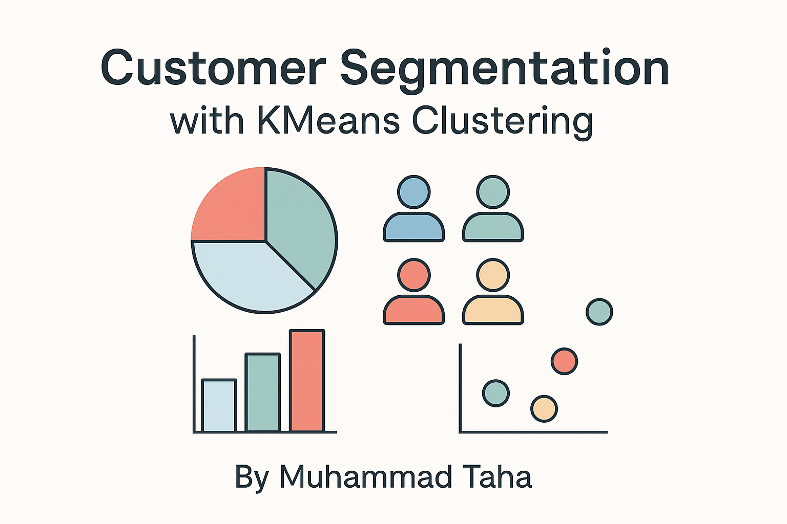

<p align="center">
  
</p>


Welcome to the **Customer Segmentation Dashboard**, a user-friendly web application powered by data science and machine learning. It helps businesses understand different types of customers based on their age, income, and spending behavior, so they can target them more effectively with tailored strategies.

---

##  What Is Customer Segmentation?

Customer segmentation means dividing customers into groups based on shared characteristics. Instead of treating every customer the same, businesses can now focus on what each group needs — whether it’s discounts, loyalty offers, or premium services.

---

##  What Does This Project Do?

This project uses **KMeans Clustering**, a popular machine learning technique, to group mall customers into meaningful segments. The result is an interactive web app where:

- You can explore the data visually  
- See which customers belong to which group  
- Upload your own data to predict new customer segments  
- Download the final clustered results  

---


##  Dashboard Features

| Feature                      | Description |
|-----------------------------|-------------|
| **Home**                    | Introduction to the app |
| **Dataset**                 | View raw customer data |
| **EDA**                     | Interactive visual analysis |
| **Clustering**              | Scatterplots, PCA, t-SNE visualizations |
| **Predict New Customer**    | Upload your own data for predictions |
| **Download Results**        | Export the final labeled customer segments |
| **About**                   | Project info, author links, and tools used |

---
#  [Click Here](https://customer-segmentation-app-o5appy3lbt2rxezkdgdbfg2.streamlit.app/) to explore the App.
---

##  Jupyter Notebook Capabilities

The original analysis was done in a Jupyter Notebook, covering:

-  **Exploratory Data Analysis (EDA)** – Age, income, and spending distributions  
-  **Data Preprocessing** – Handling missing values, scaling  
-  **Elbow Method** – Found optimal number of clusters (k=4)  
-  **KMeans Clustering** – Assigned customers to clusters  
-  **Labeling** – Gave each cluster a business-meaningful label  

---

##  Cluster Labels and Business Insights

| Cluster | Segment Label         | Description |
|--------:|------------------------|------------------------------------------------|
| 0       | Stable Traditionalists | Older, moderate spenders, average income       |
| 1       | Luxury Shoppers        | Young, high-income, high spenders              |
| 2       | Young Value Seekers    | Budget-conscious, deal-driven                  |
| 3       | Frugal Wealthy         | High income, low spending, brand-loyal         |

---

##  Tech Stack

- **Python** – Main language  
- **Streamlit** – Web app framework  
- **Pandas, Seaborn, Matplotlib, Plotly** – Data analysis & visualization  
- **Scikit-learn** – Machine learning (KMeans)  
- **Joblib** – Save/load ML models  
- **HTML/CSS** – Custom styling for UI elements  

---

##  How to Run Locally

```bash
# Clone the repository
git clone https://github.com/MuhammadTaha1038/customer-segmentation-app.git
cd customer-segmentation-app

# Install dependencies
pip install -r requirements.txt

# Run Streamlit app
streamlit run app.py
```

To use the original analysis:

```bash
jupyter notebook customer_segmentation.ipynb
```
## Future Enhancements
- Add DB integration for persistent storage

- Include demographic or geographic segmentation

- Deploy on Streamlit Cloud or Render

## Who Can Use This?
This app is perfect for:

- Marketers wanting to target campaigns better

- Retail managers optimizing product placement

- Data science learners building end-to-end projects

- Businesses making data-driven customer decisions

## Connect with me
Name: Muhammad Taha \
Email: contact.taha2005@gmail.com

 <div style="text-align: left; font-size: 20px; color: gray;">
<a href="https://github.com/MuhammadTaha1038" target="_blank" style="text-decoration: none;">
            
        </a>
        <a href="https://linkedin.com/in/muhammad-taha-b88807248/" target="_blank" style="text-decoration: none;">
            
        </a>
        <p>Github------ Linkedin</p>
</div>
